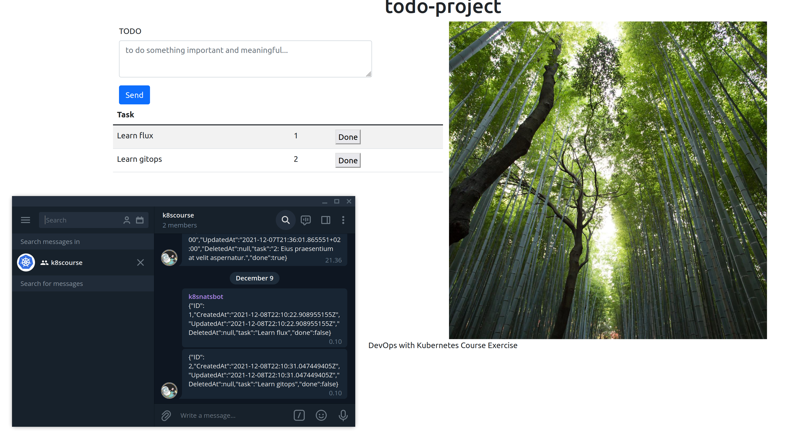

# finally

Automation is so easy...

        kubectl get deployments --all-namespaces

        NAMESPACE      NAME                                       READY   UP-TO-DATE   AVAILABLE   AGE
        kube-system    coredns                                    1/1     1            1           8h
        kube-system    local-path-provisioner                     1/1     1            1           8h
        kube-system    metrics-server                             1/1     1            1           8h
        kube-system    traefik                                    1/1     1            1           8h
        flux-system    helm-controller                            1/1     1            1           8h
        flux-system    kustomize-controller                       1/1     1            1           8h
        flux-system    notification-controller                    1/1     1            1           8h
        flux-system    source-controller                          1/1     1            1           8h
        todo-project   my-nats-box                                1/1     1            1           8h
        flux-system    grafana                                    1/1     1            1           8h
        flux-system    prometheus                                 1/1     1            1           8h
        monitoring     kube-prometheus-stack-grafana              1/1     1            1           7h59m
        monitoring     kube-prometheus-stack-kube-state-metrics   1/1     1            1           7h59m
        todo-project   todo-project-backend-db                    1/1     1            1           4h8m
        todo-project   todo-project-backend                       1/1     1            1           3h19m
        todo-project   todo-project-broadcaster                   2/2     2            2           134m
        todo-project   todo-project-frontend                      1/1     1            1           50m
        monitoring     kube-prometheus-stack-operator             1/1     1            1           7h59m

